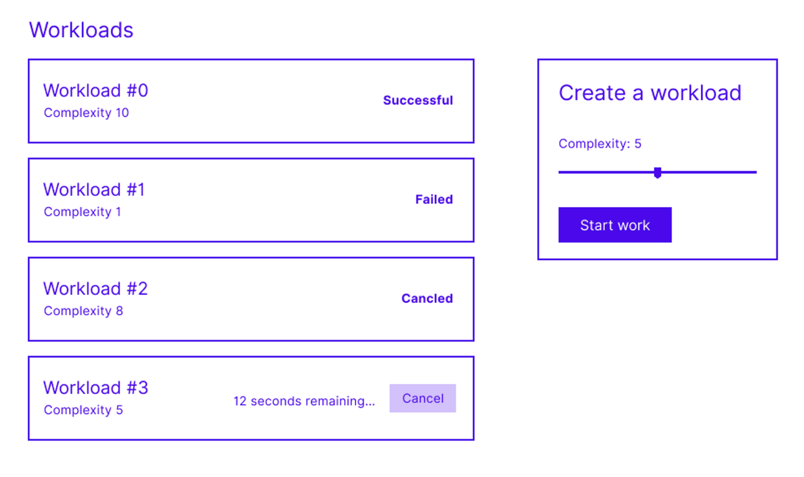

# Worker Exercise

## The goals of this exercise

The goal of this exercise is to establish the ability to understand a brief and demonstrate general web development skills. 

You are not expected to complete all aspects of the brief.

Ideally this would be a couple of hours with a goal of solving 3-4 of the problems described below.


## Setting the scene

Worker is a web app that allows user to manage _workloads_. Workloads are jobs which run in the cloud. They are created with a complexity number which increases the amount of time the workload takes to complete. A workload will complete with a success or failure status.



The app should allow users to:

- View their workloads
- Create new workloads
- View a workload’s up-to-date status
- Cancel workloads that are incomplete

## The code we have provided

What’s included:

- A bare-bones Next.js app
- A `MockWorkerService` class which behaves like a backend service. It offers Typescript interfaces of the data the service returns.
- Some functional UI components .
- A functional `Form` component.
- An incomplete `AppController` class which is build with Mobx.

## Problems to solve

We would like for you to demonstrate a range of web development skills by solving a few different problems.

Don't feel like you must solve all of these problems but please complete at least one from each of the sections.

- State management
  - Wire-up the `Form` component so that users can create workloads
  - Give users feedback if there was an error when creating a workload
- Styling
  - Add responsive layout to lay the app out like the wire-frame but able fit on any size screen
  - Give the `Item` and `List` components some basic styling to make it more pleasant on the eyes
- Interaction
  - Display an updating count-down of the time remaining until a workload completes
  - Give users the ability to cancel a workload only before it is complete

## Getting started with the code

Run the development server:

```bash
npm run dev
# or
yarn dev
# or
pnpm dev
```

Open [http://localhost:3000](http://localhost:3000) with your browser to see the result.
